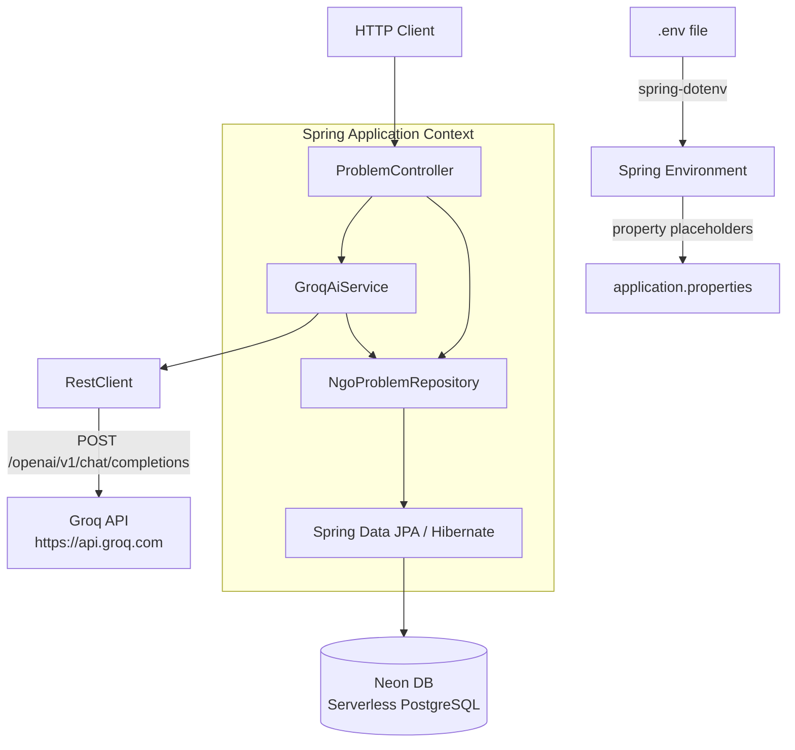
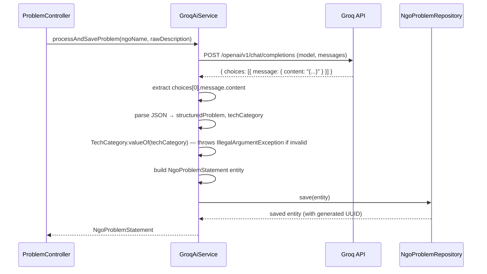

# Design Document: Connecting-Dots Matchmaker Service

## Overview

Connecting-Dots is a Spring Boot 3 microservice written in Java 21 (LTS), built with Maven and compiled targeting Java 21 for maximum library compatibility. The JDK 25 environment is used to run the build, but the language level is pinned to 21 to avoid incompatibilities with annotation processors. This spec covers: Maven project scaffold, build configuration (pom.xml), application entry point, environment-variable-based configuration for a 100% serverless infrastructure stack (Neon DB, Upstash Redis, Groq LLM API), the domain layer (JPA entity, enum, repository), an AI integration service backed by the Groq LLM API, and a REST API for NGO problem submission and retrieval.

The service follows a conventional layered Spring Boot architecture. Credentials are never hard-coded — all secrets are loaded from a `.env` file at startup via `spring-dotenv`.

## Architecture

### Project Structure

```
connecting-dots/
├── .mvn/wrapper/maven-wrapper.properties
├── src/
│   ├── main/
│   │   ├── java/com/connectingdots/
│   │   │   ├── ConnectingDotsApplication.java
│   │   │   ├── controller/
│   │   │   │   └── ProblemController.java
│   │   │   ├── domain/
│   │   │   │   ├── TechCategory.java
│   │   │   │   ├── NgoProblemStatement.java
│   │   │   │   └── NgoProblemRepository.java
│   │   │   └── service/
│   │   │       └── GroqAiService.java
│   │   └── resources/
│   │       └── application.properties
│   └── test/java/com/connectingdots/
│       ├── ConnectingDotsApplicationTests.java
│       ├── service/GroqAiServiceTest.java
│       └── controller/ProblemControllerTest.java
├── .env
├── mvnw / mvnw.cmd
└── pom.xml
```

### Layered Architecture



### Environment Variable Loading

`me.paulschwarz:spring-dotenv` is a Spring `EnvironmentPostProcessor` that reads `.env` from the working directory and injects each entry as a Spring environment property before the application context starts. This means `${NEON_DB_URL}` in `application.properties` resolves to the value in `.env` with no extra code.

## Components and Interfaces

### Maven Wrapper

| File | Purpose |
|------|---------|
| `mvnw` | Unix/macOS shell script — invokes the pinned Maven version |
| `mvnw.cmd` | Windows batch script equivalent |
| `.mvn/wrapper/maven-wrapper.properties` | Declares the Maven distribution URL |

### pom.xml

Inherits from `spring-boot-starter-parent:3.3.4` for dependency management and default plugin configuration.

```xml
<parent>
    <groupId>org.springframework.boot</groupId>
    <artifactId>spring-boot-starter-parent</artifactId>
    <version>3.3.4</version>
</parent>

<properties>
    <java.version>21</java.version>
</properties>
```

Dependencies:

| Dependency | Scope | Purpose |
|-----------|-------|---------|
| `spring-boot-starter-web` | compile | Embedded Tomcat + Spring MVC / REST |
| `spring-boot-starter-data-jpa` | compile | Spring Data JPA + Hibernate ORM |
| `org.postgresql:postgresql` | runtime | JDBC driver for Neon DB (PostgreSQL) |
| `spring-boot-starter-data-redis` | compile | Spring Data Redis (Lettuce, TLS) |
| `spring-boot-starter-validation` | compile | Bean Validation (`@NotBlank`, `@Valid`) |
| `me.paulschwarz:spring-dotenv:3.0.0` | compile | Loads `.env` into Spring Environment |
| `spring-boot-starter-test` | test | JUnit 5, Mockito, AssertJ |

Plugin:

```xml
<plugin>
    <groupId>org.apache.maven.plugins</groupId>
    <artifactId>maven-compiler-plugin</artifactId>
    <configuration>
        <release>21</release>
    </configuration>
</plugin>
<plugin>
    <groupId>org.springframework.boot</groupId>
    <artifactId>spring-boot-maven-plugin</artifactId>
</plugin>
```

### ConnectingDotsApplication

```java
package com.connectingdots;

import org.springframework.boot.SpringApplication;
import org.springframework.boot.autoconfigure.SpringBootApplication;

@SpringBootApplication
public class ConnectingDotsApplication {
    public static void main(String[] args) {
        SpringApplication.run(ConnectingDotsApplication.class, args);
    }
}
```

`@SpringBootApplication` enables auto-configuration, component scanning of `com.connectingdots` and sub-packages, and marks this as a configuration source.

### application.properties

```properties
# DataSource — Neon DB (serverless PostgreSQL)
spring.datasource.url=${NEON_DB_URL}
spring.datasource.username=${NEON_DB_USERNAME}
spring.datasource.password=${NEON_DB_PASSWORD}

# Hibernate / JPA
spring.jpa.hibernate.ddl-auto=update
spring.jpa.show-sql=true
spring.jpa.properties.hibernate.format_sql=true

# Redis — Upstash (serverless, TLS required)
spring.data.redis.host=${UPSTASH_REDIS_HOST}
spring.data.redis.port=${UPSTASH_REDIS_PORT}
spring.data.redis.password=${UPSTASH_REDIS_PASSWORD}
spring.data.redis.ssl.enabled=true

# Groq LLM API
groq.api.key=${GROQ_API_KEY}
```

Design decision: `ddl-auto=update` is used for development convenience. Production deployments should override with `validate` or `none` and use Flyway/Liquibase.

## Data Models

### TechCategory Enum

```java
package com.connectingdots.domain;

public enum TechCategory {
    SOFTWARE_WEB,
    DATA_SCIENCE_ML,
    IOT_HARDWARE,
    PROCESS_AUTOMATION
}
```

### NgoProblemStatement Entity

```java
package com.connectingdots.domain;

import jakarta.persistence.*;
import java.util.UUID;

@Entity
public class NgoProblemStatement {

    @Id
    @GeneratedValue(strategy = GenerationType.UUID)
    private UUID id;

    private String ngoName;

    @Column(columnDefinition = "TEXT")
    private String rawDescription;

    @Column(columnDefinition = "TEXT")
    private String structuredProblem;

    @Enumerated(EnumType.STRING)
    private TechCategory techCategory;

    private String status = "OPEN";

    public NgoProblemStatement() {}

    public NgoProblemStatement(UUID id, String ngoName, String rawDescription,
                                String structuredProblem, TechCategory techCategory, String status) {
        this.id = id;
        this.ngoName = ngoName;
        this.rawDescription = rawDescription;
        this.structuredProblem = structuredProblem;
        this.techCategory = techCategory;
        this.status = status;
    }

    // standard getters and setters for all fields
}
```

### NgoProblemRepository

```java
package com.connectingdots.domain;

import org.springframework.data.jpa.repository.JpaRepository;
import java.util.List;
import java.util.UUID;

public interface NgoProblemRepository extends JpaRepository<NgoProblemStatement, UUID> {
    List<NgoProblemStatement> findByStatus(String status);
}
```

`findByStatus` is a Spring Data derived query — no implementation needed.

## Service Layer: GroqAiService

### Groq API Request Structure

Endpoint: `POST https://api.groq.com/openai/v1/chat/completions`

Request body (JSON):

```json
{
  "model": "llama-3.1-8b-instant",
  "messages": [
    {
      "role": "system",
      "content": "You are a Business Analyst assistant. Analyze the following NGO problem description and return ONLY a valid JSON object with exactly two keys: \"structuredProblem\" (a clear technical summary of the problem) and \"techCategory\" (must be exactly one of: SOFTWARE_WEB, DATA_SCIENCE_ML, IOT_HARDWARE, PROCESS_AUTOMATION). Do not include any explanation or markdown."
    },
    {
      "role": "user",
      "content": "<rawDescription>"
    }
  ]
}
```

Authorization header: `Authorization: Bearer {groq.api.key}`

### RestClient Construction

```java
@Service
public class GroqAiService {

    private final RestClient restClient;
    private final NgoProblemRepository repository;

    public GroqAiService(
            @Value("${groq.api.key}") String apiKey,
            NgoProblemRepository repository) {
        this.repository = repository;
        this.restClient = RestClient.builder()
                .baseUrl("https://api.groq.com")
                .defaultHeader("Authorization", "Bearer " + apiKey)
                .build();
    }
    // ...
}
```

### processAndSaveProblem Flow



### Response Parsing

1. Extract `choices[0].message.content` from the Groq response.
2. Parse the content string as JSON.
3. Read `structuredProblem` (String) and `techCategory` (String).
4. Call `TechCategory.valueOf(techCategory)` — throws `IllegalArgumentException` if the value is not a valid enum constant.
5. Build and save the `NgoProblemStatement` entity.

## REST API: ProblemController

Base path: `/api/v1/problems`

### POST /api/v1/problems/submit

- Request body: `{ "ngoName": "...", "rawDescription": "..." }`
- Delegates to `GroqAiService.processAndSaveProblem(ngoName, rawDescription)`
- Returns: saved `NgoProblemStatement` with HTTP 200
- Missing fields: HTTP 400 (handled by `@Valid` + `@NotBlank` on the request DTO, or Spring's default binding error)

### GET /api/v1/problems/open

- No request body
- Calls `NgoProblemRepository.findByStatus("OPEN")`
- Returns: `List<NgoProblemStatement>` with HTTP 200

### Request DTO

```java
public record ProblemSubmitRequest(
    @NotBlank String ngoName,
    @NotBlank String rawDescription
) {}
```

## Correctness Properties

*A property is a characteristic or behavior that should hold true across all valid executions of a system — essentially, a formal statement about what the system should do. Properties serve as the bridge between human-readable specifications and machine-verifiable correctness guarantees.*

The structural and configuration criteria (requirements 1–7, 9.1) are point-in-time existence/value checks and are expressed as **examples**. The behavioral criteria for the service and REST layer (requirements 8, 9.2–9.4) are universally quantified and expressed as **properties**.

### Property 1: Groq request structure is always correct

*For any* valid `ngoName` and `rawDescription`, every call to `processAndSaveProblem` must produce an outbound HTTP POST to `https://api.groq.com/openai/v1/chat/completions` with model `llama-3.1-8b-instant`, an `Authorization: Bearer` header containing the configured API key, and a system message containing the Business Analyst prompt.

**Validates: Requirements 8.2, 8.3, 8.4**

### Property 2: processAndSaveProblem round-trip

*For any* valid `ngoName` and `rawDescription` where the Groq API returns a valid JSON response with a recognised `techCategory`, calling `processAndSaveProblem` must persist an `NgoProblemStatement` to the repository and return the same entity (with a non-null UUID, matching `ngoName`, `structuredProblem`, `techCategory`, and `status = "OPEN"`).

**Validates: Requirements 8.5**

### Property 3: Invalid techCategory is rejected

*For any* Groq API response whose `techCategory` value is not one of `SOFTWARE_WEB`, `DATA_SCIENCE_ML`, `IOT_HARDWARE`, `PROCESS_AUTOMATION`, calling `processAndSaveProblem` must throw an `IllegalArgumentException` and must not persist any entity.

**Validates: Requirements 8.6**

### Property 4: POST /submit returns saved entity for valid input

*For any* valid `ngoName` and `rawDescription`, a POST to `/api/v1/problems/submit` must return HTTP 200 and a response body that is the saved `NgoProblemStatement` returned by `GroqAiService`.

**Validates: Requirements 9.2**

### Property 5: GET /open returns only OPEN records

*For any* set of persisted `NgoProblemStatement` records with mixed `status` values, a GET to `/api/v1/problems/open` must return exactly the subset whose `status` equals `"OPEN"` and no others.

**Validates: Requirements 9.3**

### Property 6: POST /submit with missing fields returns 400

*For any* POST to `/api/v1/problems/submit` where `ngoName` or `rawDescription` is absent or blank, the response must be HTTP 400 and no call to `GroqAiService` must be made.

**Validates: Requirements 9.4**

---

### Consolidated Examples

#### Example 1: Maven structure and wrapper scripts exist

The four standard Maven source directories and both wrapper scripts (`mvnw`, `mvnw.cmd`) are present.

**Validates: Requirements 1.1, 1.2, 1.3**

#### Example 2: POM declares correct parent, Java version, all dependencies, and plugin

Parsing `pom.xml` confirms: parent `spring-boot-starter-parent:3.3.x`, `<java.version>21</java.version>`, all runtime/compile dependencies (including `me.paulschwarz:spring-dotenv:3.0.0` and `spring-boot-starter-validation`), and `spring-boot-maven-plugin`.

**Validates: Requirements 2.1–2.9**

#### Example 3: Application class is correctly annotated and located

`com.connectingdots.ConnectingDotsApplication` carries `@SpringBootApplication` and resides in package `com.connectingdots`.

**Validates: Requirements 3.1, 3.2**

#### Example 4: Spring application context loads successfully

A `@SpringBootTest` integration test with mocked infrastructure confirms `SpringApplication.run` completes without exception.

**Validates: Requirement 3.3**

#### Example 5: application.properties contains all required env-var placeholders and config values

Loading `application.properties` confirms all DataSource, JPA, Redis, and Groq key properties are set to the specified values (env-var placeholders and literal values).

**Validates: Requirements 4.1–4.8, 5.1–5.3, 6.1–6.4**

#### Example 6: Domain layer structure is correct

Reflection confirms: `TechCategory` has exactly four constants; `NgoProblemStatement` carries `@Entity`, has an `id` field of type `UUID` with `@Id` and `@GeneratedValue(strategy = GenerationType.UUID)`, a `rawDescription` and `structuredProblem` with `@Column(columnDefinition = "TEXT")`, a `techCategory` with `@Enumerated(EnumType.STRING)`, a `status` field with default `"OPEN"`, a no-args constructor, a full-args constructor, and standard getters/setters; `NgoProblemRepository` extends `JpaRepository<NgoProblemStatement, UUID>` and declares `findByStatus`.

**Validates: Requirements 7.1–7.9**

#### Example 7: ProblemController base path and endpoint mappings

Loading the Spring MVC context confirms `ProblemController` is mapped to `/api/v1/problems`, with a POST handler at `/submit` and a GET handler at `/open`.

**Validates: Requirement 9.1**

## Error Handling

| Scenario | Behaviour |
|----------|-----------|
| Groq API returns non-2xx | `RestClient` throws `RestClientException`; propagates as HTTP 502 via `@ControllerAdvice` |
| Groq response content is not valid JSON | `JsonProcessingException` thrown during parsing; propagates as HTTP 502 |
| `techCategory` value not in enum | `IllegalArgumentException` thrown in `GroqAiService`; propagates as HTTP 422 |
| POST body missing `ngoName` or `rawDescription` | Spring validation (`@Valid` + `@NotBlank`) returns HTTP 400 before reaching service layer |
| Neon DB unreachable on startup | Hibernate throws `DataSourceLookupFailureException`; context fails to start |
| Upstash Redis unreachable on startup | Lettuce throws on startup; context fails to start |

A global `@ControllerAdvice` should map these exceptions to structured JSON error responses:

```json
{ "status": 502, "error": "Groq API error", "message": "..." }
```

## Testing Strategy

### Dual Testing Approach

Both unit/slice tests and property-based tests are used. Property-based tests use [jqwik](https://jqwik.net/) (Java PBT library), configured with a minimum of 100 tries per property.

### Unit Tests

Focus on specific structural facts and edge cases without starting the full Spring context:

- **POM structure test**: Parse `pom.xml` with a standard XML parser; assert parent, Java version, all dependencies, plugin.
- **Directory layout test**: Use `java.nio.file.Files` to assert Maven source directories and wrapper scripts.
- **Application class annotation test**: Reflection check for `@SpringBootApplication` and package name.
- **Properties file test**: Load `application.properties` via `ClassLoader.getResourceAsStream`; assert each key/value.
- **Domain layer test**: Reflection checks for enum constants, entity annotations, field annotations, repository interface.

### Controller Slice Tests (`@WebMvcTest`)

Use `@WebMvcTest(ProblemController.class)` with `@MockBean GroqAiService` and `@MockBean NgoProblemRepository`:

- POST `/api/v1/problems/submit` with valid body → mock returns entity → assert HTTP 200 and response body.
- POST `/api/v1/problems/submit` with missing fields → assert HTTP 400, verify `GroqAiService` never called.
- GET `/api/v1/problems/open` → mock returns list → assert HTTP 200 and list contents.

```java
// Feature: force-for-good-matchmaker-setup, Property 4: POST /submit returns saved entity for valid input
// Feature: force-for-good-matchmaker-setup, Property 6: POST /submit with missing fields returns 400
```

### Repository Tests (`@DataJpaTest`)

Use `@DataJpaTest` with an in-memory H2 datasource (or Testcontainers for Neon-compatible PostgreSQL):

- Save records with mixed statuses; call `findByStatus("OPEN")`; assert only OPEN records returned.

```java
// Feature: force-for-good-matchmaker-setup, Property 5: GET /open returns only OPEN records
```

### GroqAiService Property-Based Tests (jqwik)

Mock `RestClient` to return controlled responses. Use jqwik `@Property` with `@ForAll` generators:

```java
// Feature: force-for-good-matchmaker-setup, Property 1: Groq request structure is always correct
@Property(tries = 100)
void groqRequestAlwaysHasCorrectStructure(@ForAll String ngoName, @ForAll String rawDescription) { ... }

// Feature: force-for-good-matchmaker-setup, Property 2: processAndSaveProblem round-trip
@Property(tries = 100)
void processAndSaveRoundTrip(@ForAll String ngoName, @ForAll String rawDescription) { ... }

// Feature: force-for-good-matchmaker-setup, Property 3: Invalid techCategory is rejected
@Property(tries = 100)
void invalidTechCategoryThrows(@ForAll @StringNotInEnum String badCategory) { ... }
```

### Integration Test

A single `@SpringBootTest` with `@TestPropertySource` overrides (or `spring.autoconfigure.exclude` to skip DataSource/Redis) verifies the application context starts without errors.

```java
// Feature: force-for-good-matchmaker-setup, Example 4: Spring application context loads successfully
```
