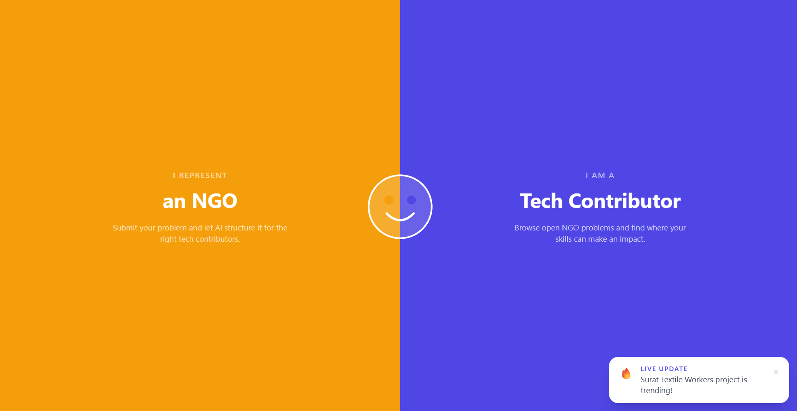
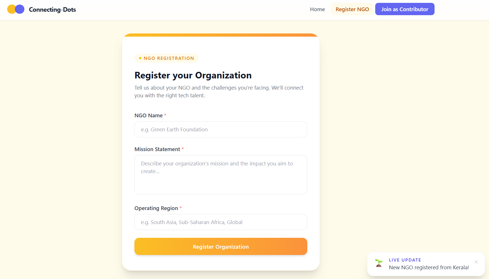
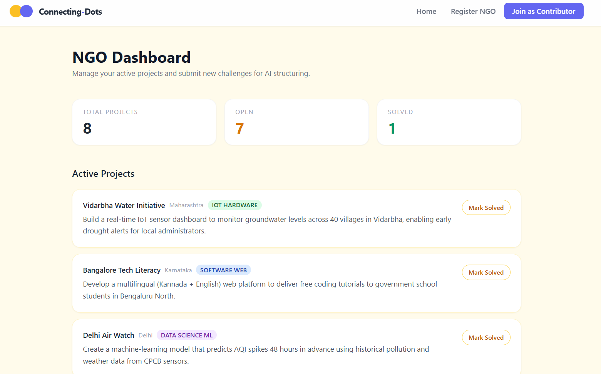
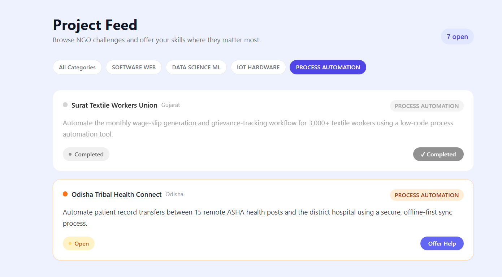
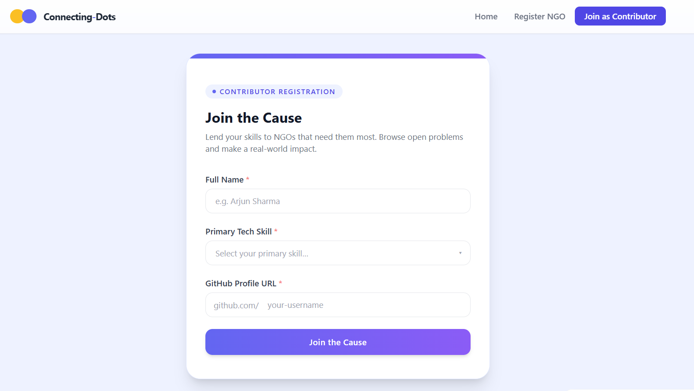

# Connecting-Dots: AI-Driven NGO Problem Structuring Platform


---

## Platform Overview

**Connecting-Dots** is a full-stack platform that acts as an **automated Business Analyst** for non-profit organisations. NGOs submit raw, unstructured problem descriptions through a React frontend. The Spring Boot backend forwards each submission to the **Groq LLM API** (`llama-3.1-8b-instant`), which parses the input and returns a precise technical summary alongside a strict technology category classification. The structured result is persisted to a **serverless PostgreSQL database** (Neon DB) and immediately surfaced to volunteer tech contributors browsing the live project feed — where they can discover, filter, and claim open challenges.

The platform eliminates the manual overhead of interpreting vague problem statements and removes the friction between NGOs with real-world challenges and developers who want to apply their skills meaningfully.

```
React Frontend (Vite · Tailwind · Framer Motion)
        │
        │  axios  →  POST /api/v1/problems/submit
        │            GET  /api/v1/problems/open
        ▼
Spring Boot Backend  (Java 21 · Spring Web · Spring Data JPA)
        │
        ├──►  Groq API  (llama-3.1-8b-instant)
        │         └── returns structuredProblem + techCategory
        │
        └──►  Neon DB  (Serverless PostgreSQL)
                  └── persists NgoProblemStatement
```

---

## Platform Preview







---

## Tech Stack

### Frontend

| Technology | Role |
|---|---|
| React 18 + Vite 5 | UI framework and dev build tool |
| Tailwind CSS 3 | Utility-first styling |
| Framer Motion 11 | Page transitions and micro-animations |
| Axios | HTTP client — communicates with the Spring Boot API |
| React Router DOM v6 | Client-side routing |

### Backend

| Technology | Role |
|---|---|
| Java 21 (JDK 25 runtime) | Application language |
| Spring Boot 3.3.4 | Framework — web, JPA, validation, auto-config |
| Spring Data JPA + Hibernate | ORM and schema management |
| Neon DB (Serverless PostgreSQL) | Primary persistence layer |
| Upstash Redis (Serverless, TLS) | Cache / session layer |
| Groq API — `llama-3.1-8b-instant` | LLM for problem structuring and categorisation |
| Spring `RestClient` | Outbound HTTP to Groq API |
| `spring-dotenv` | Loads `.env` into Spring Environment at startup |
| Maven Wrapper | Self-contained build — no Maven install required |

---

## Local Setup

### Prerequisites

- JDK 25 (compiles to Java 21 target)
- Node.js 18+ and npm
- [Neon DB](https://neon.tech) project with a database
- [Upstash Redis](https://upstash.com) database (TLS enabled)
- [Groq API key](https://console.groq.com)

---

### Step 1 — Clone the repository

```bash
git clone https://github.com/your-username/connecting-dots.git
cd connecting-dots
```

---

### Step 2 — Configure environment variables

Create a `.env` file in the **project root** (never commit this file):

```env
# Neon DB — Serverless PostgreSQL
NEON_DB_URL=jdbc:postgresql://<your-neon-host>/neondb?sslmode=require
NEON_DB_USERNAME=your_neon_username
NEON_DB_PASSWORD=your_neon_password

# Upstash Redis — Serverless, TLS required
UPSTASH_REDIS_HOST=your-upstash-host.upstash.io
UPSTASH_REDIS_PORT=6379
UPSTASH_REDIS_PASSWORD=your_upstash_password

# Groq LLM API
GROQ_API_KEY=your_groq_api_key
```

> `spring-dotenv` reads this file automatically on startup and injects each entry as a Spring environment property. No code changes required.

---

### Step 3 — Start the backend

```bash
# Unix / macOS
./mvnw clean spring-boot:run

# Windows
mvnw.cmd clean spring-boot:run
```

The API starts on **`http://localhost:8080`**.

---

### Step 4 — Start the frontend

Open a second terminal:

```bash
cd frontend
npm install
npm run dev
```

The React app starts on **`http://localhost:5173`**.

---

## Core API Endpoints

### `POST /api/v1/problems/submit`

Accepts a raw NGO problem description, calls the Groq LLM to structure it, and persists the result.

**Request body**

```json
{
  "ngoName": "Clean Water Initiative",
  "rawDescription": "We collect water quality data on paper forms from 50 villages every week but have no way to analyse trends or alert communities when contamination is dangerous."
}
```

**Response** `200 OK`

```json
{
  "id": "a3f1c2d4-8b7e-4f2a-9c1d-0e5f6a7b8c9d",
  "ngoName": "Clean Water Initiative",
  "rawDescription": "We collect water quality data...",
  "structuredProblem": "The organisation requires a digital data collection and analytics platform to replace paper-based water quality monitoring across 50 field sites, with automated contamination alerting.",
  "techCategory": "DATA_SCIENCE_ML",
  "status": "OPEN"
}
```

**Validation** — returns `400 Bad Request` if `ngoName` or `rawDescription` is blank.

---

### `GET /api/v1/problems/open`

Returns all persisted problems with `status = "OPEN"`.

**Response** `200 OK`

```json
[
  {
    "id": "a3f1c2d4-8b7e-4f2a-9c1d-0e5f6a7b8c9d",
    "ngoName": "Clean Water Initiative",
    "structuredProblem": "...",
    "techCategory": "DATA_SCIENCE_ML",
    "status": "OPEN"
  }
]
```

---

### Tech Category Enum

| Value | Domain |
|---|---|
| `SOFTWARE_WEB` | Web apps, mobile apps, portals |
| `DATA_SCIENCE_ML` | Analytics, ML models, dashboards |
| `IOT_HARDWARE` | Sensors, embedded systems, hardware |
| `PROCESS_AUTOMATION` | Workflow automation, RPA, scripting |

---

## Project Structure

```
connecting-dots/
│
├── frontend/                            # React + Vite frontend
│   ├── src/
│   │   ├── api/client.ts               # Axios instance (baseURL: localhost:8080/api/v1)
│   │   ├── components/
│   │   │   ├── AppLayout.tsx           # Navbar + Outlet layout wrapper
│   │   │   ├── Navbar.tsx              # Sticky global navigation bar
│   │   │   └── LiveToast.tsx           # Simulated real-time facilitation toasts
│   │   ├── context/ProjectContext.tsx  # Global state + mock project data
│   │   └── pages/
│   │       ├── Landing.tsx             # Animated split-screen hero
│   │       ├── NgoDashboard.tsx        # AI submit form + active project list
│   │       ├── ContributorDashboard.tsx# Live project feed from database
│   │       ├── NgoRegister.tsx         # NGO registration form
│   │       └── ContributorRegister.tsx # Contributor registration form
│   ├── tailwind.config.js
│   └── vite.config.ts
│
└── src/main/java/com/connectingdots/  # Spring Boot backend
    ├── ConnectingDotsApplication.java  # Entry point (@SpringBootApplication)
    ├── controller/ProblemController.java   # REST layer + CORS config
    ├── domain/
    │   ├── NgoProblemStatement.java    # JPA entity (plain POJO)
    │   ├── NgoProblemRepository.java   # Spring Data JPA repository
    │   └── TechCategory.java          # Enum: 4 technology domains
    └── service/GroqAiService.java      # Groq LLM integration via RestClient
```

---

## Database Schema

Hibernate manages the schema automatically (`ddl-auto=update`). The `ngo_problem_statement` table is created on first run:

| Column | Type | Notes |
|---|---|---|
| `id` | UUID | Primary key, auto-generated |
| `ngo_name` | VARCHAR | Organisation name |
| `raw_description` | TEXT | Original unstructured input |
| `structured_problem` | TEXT | AI-generated technical summary |
| `tech_category` | VARCHAR | Enum value stored as string |
| `status` | VARCHAR | Default: `OPEN` |

---

## Roadmap

- [ ] JWT-based authentication for NGO and Contributor accounts
- [ ] Volunteer profile matching engine
- [ ] WebSocket integration for real-time facilitation messages
- [ ] Flyway database migrations
- [ ] Production deployment (Railway / Render + Vercel)

---

## License

MIT — see [LICENSE](LICENSE) for details.
