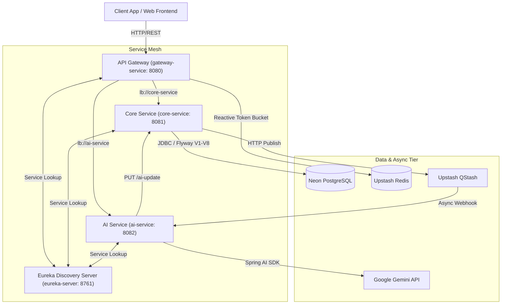

# Connecting Dots: Enterprise Backend Architecture

## 1. System Overview & Executive Summary

Connecting Dots is a microservices-based platform designed to bridge the gap between grassroots Non-Governmental Organizations (NGOs) and technical contributors. NGOs upload unstructured problem descriptions (via documents or voice notes), which are ingested, parsed, structured, and translated by an AI microservice. Contributors apply to solve these challenges, coordinate via lightweight communication threads, and complete projects to build verified platform reputations.

The backend is built strictly following enterprise domain-driven design principles, utilizing Java 25, Spring Boot 4.0.7, Spring Cloud 2025.1.2, Spring AI 2.0.0, Neon PostgreSQL, Upstash QStash, and Upstash Redis.

---

## 2. Architecture & Service Mesh Overview


```mermaid
graph TD
    Client["Client App / Web Frontend"] -->|HTTP/REST| GW["API Gateway (gateway-service: 8080)"]
    
    subgraph Service Mesh
        Eureka["Eureka Discovery Server (eureka-server: 8761)"]
        GW <-->|Service Lookup| Eureka
        
        GW -->|lb://core-service| CS["Core Service (core-service: 8081)"]
        GW -->|lb://ai-service| AI["AI Service (ai-service: 8082)"]
        
        CS <-->|Service Lookup| Eureka
        AI <-->|Service Lookup| Eureka
    end

    subgraph Data & Async Tier
        CS -->|JDBC / Flyway V1-V8| DB[("Neon PostgreSQL")]
        GW -->|Reactive Token Bucket| Redis[("Upstash Redis")]
        CS -->|HTTP Publish| QStash["Upstash QStash"]
        QStash -->|Async Webhook| AI
        AI -->|Spring AI SDK| Gemini["Google Gemini API"]
        AI -->|PUT /ai-update| CS
    end
```

---

## 3. The Core Tech Stack & Architectural Blueprint

| Component | Technology | Role & Responsibility |
| :--- | :--- | :--- |
| **Language & Runtime** | Java 25 | Core execution engine leveraging modern Java 25 records and patterns. |
| **Microservices Core** | Spring Boot 4.0.7 / Spring Cloud 2025.1.2 | Framework foundation for dependency injection, web servers, and distributed patterns. |
| **Service Discovery** | Spring Cloud Netflix Eureka | Dynamic service registration and health monitoring registry (`port 8761`). |
| **API Gateway** | Spring Cloud Gateway (Reactive WebFlux) | Single public entry point handling dynamic routing (`lb://`), JWT validation, and Redis-backed rate limiting (`port 8080`). |
| **Primary Database** | Neon Serverless PostgreSQL | Relational ACID storage managed via versioned Flyway migrations (`V1` to `V8`). |
| **Asynchronous Broker** | Upstash QStash (Serverless HTTP Queues) | Offloading heavyweight AI parsing tasks to avoid HTTP 504 timeouts. |
| **AI & Multimodal Engine** | Spring AI 2.0.0 (Google GenAI Starter) | Interfacing with Gemini 3.5 Flash models via `ChatClient` fluid API for structured extraction, multimodal parsing, and localization. |
| **Caching & Rate Limiting** | Upstash Redis (Reactive) | Token-bucket rate limiting state storage and low-latency response caching. |
| **Testing Framework** | Testcontainers & WireMock | Spin-up of real isolated PostgreSQL Docker containers and inter-service stubbing. |

---

## 4. Component-by-Component Deep Dive

### A. `eureka-server` (The Phonebook Directory)
* **What it is:** A Netflix Eureka registry server running on port `8761`.
* **Why it exists:** In a microservices architecture, services scale dynamically and their network locations change. Instead of hardcoding URLs, downstream services register themselves with Eureka upon booting.
* **How it works:** `core-service` and `ai-service` heartbeat into Eureka every few seconds. The API Gateway queries Eureka to resolve service names (e.g., `lb://core-service`) into active network locations.

### B. `gateway-service` (The Secure Border Guard)
* **What it is:** A non-blocking, reactive Spring Cloud Gateway running on port `8080` built on Project Reactor (Netty).
* **Why it exists:** Exposing internal microservices directly to the public web is a security hazard. The gateway centralizes cross-cutting concerns: authentication validation, request routing, and traffic throttling.
* **How it works:** Incoming client requests hit the Gateway. A custom JWT validation filter inspects the `Authorization` header. If valid, the request passes through a Redis-backed `RequestRateLimiter` (configured for 10 requests/sec with burst capacity of 20 via `#{@ipKeyResolver}`) before being load-balanced to downstream services.

### C. `core-service` (The Business Logic Engine)
* **What it is:** The monolithic core of business operations running on port `8081`.
* **Why it exists:** Handles user authentication, profile management, NGO problem ingestion triggers, contributor applications, review loops, and messaging threads.
* **How it works:** Exposes secure REST endpoints. When an NGO uploads a file for ingestion, `core-service` records the initial state (`PROCESSING`), pushes a background execution payload to Upstash QStash, and returns control immediately to prevent gateway timeout bottlenecks. Optimistic concurrency control (`@Version`) prevents state corruption during concurrent updates.

### D. `ai-service` (The Intelligent Worker Node)
* **What it is:** An isolated Spring Boot microservice running on port `8082` dedicated entirely to artificial intelligence operations.
* **Why it exists:** Decoupling resource-intensive AI parsing, document extraction, and Gemini LLM calls from the transactional `core-service` protects core database operations from CPU and memory starvation.
* **How it works:** Receives asynchronous webhooks from QStash, downloads raw documents, processes unstructured text into structured problem DTOs using Spring AI 2.0.0 `ChatClient`, performs dynamic language translations, and calls back `core-service` via `RestClient` with finalized drafts.

---

## 5. End-to-End Sequence Flow: AI Problem Ingestion Pipeline

```text
[NGO Client] 
    │
    │ 1. POST /api/v1/core/problem-statements (Uploads PDF/Audio URL)
    ▼
[Gateway] ──> [Core Service]
                    │
                    ├─ 2. Saves Problem (Status: PROCESSING)
                    ├─ 3. Publishes Webhook Payload to Upstash QStash
                    │
                    └─ 4. Returns HTTP 202 Accepted (Instant Response)
                            │
                            ▼
                    [Upstash QStash Queue]
                            │
                            │ 5. Executes Asynchronous HTTP POST
                            ▼
                    [AI Service]
                            │
                            ├─ 6. Extracts Text & Document Metadata
                            ├─ 7. Structures Data via Gemini LLM (Spring AI 2.0.0 ChatClient)
                            │
                            └─ 8. PUT /api/v1/core/problem-statements/{id}/ai-update (Callback)
                                    │
                                    ▼
                            [Core Service updates status to PROCESSED / DRAFT]
```

---

## 6. Local Development & Quickstart Setup

### Prerequisites
- Java 25 JDK installed
- Maven 3.8+ installed (or use `./mvnw` wrappers)
- PostgreSQL / Neon connection credentials
- Upstash Redis & QStash accounts / credentials
- Google Gemini API key

### Starting Services Sequentially
1. **Start Eureka Discovery Server:**
   ```bash
   cd connecting-dots-backend/eureka-server
   ./mvnw spring-boot:run
   ```
2. **Start API Gateway:**
   ```bash
   cd connecting-dots-backend/gateway-service
   ./mvnw spring-boot:run
   ```
3. **Start Core Service:**
   ```bash
   cd connecting-dots-backend/core-service
   ./mvnw spring-boot:run
   ```
4. **Start AI Service:**
   ```bash
   cd connecting-dots-backend/ai-service
   ./mvnw spring-boot:run
   ```

Alternatively, use the provided PowerShell helper script:
```powershell
.\connecting-dots-backend\restart-system.ps1
```

---

## 7. Configuration Reference (`application.yml`)

Key environment variables required across services:

| Service | Property Key | Environment Variable | Default / Description |
| :--- | :--- | :--- | :--- |
| `gateway-service` | `spring.data.redis.host` | `REDIS_HOST` | `localhost` |
| `gateway-service` | `spring.data.redis.port` | `REDIS_PORT` | `6379` |
| `core-service` | `spring.datasource.url` | `SPRING_DATASOURCE_URL` | Neon PostgreSQL JDBC URL |
| `core-service` | `qstash.token` | `QSTASH_TOKEN` | Upstash QStash API Bearer Token |
| `ai-service` | `gemini.api.key` | `GEMINI_API_KEY` | Google GenAI API Key |
| `ai-service` | `core.service.url` | `CORE_SERVICE_URL` | `http://localhost:8081` |
