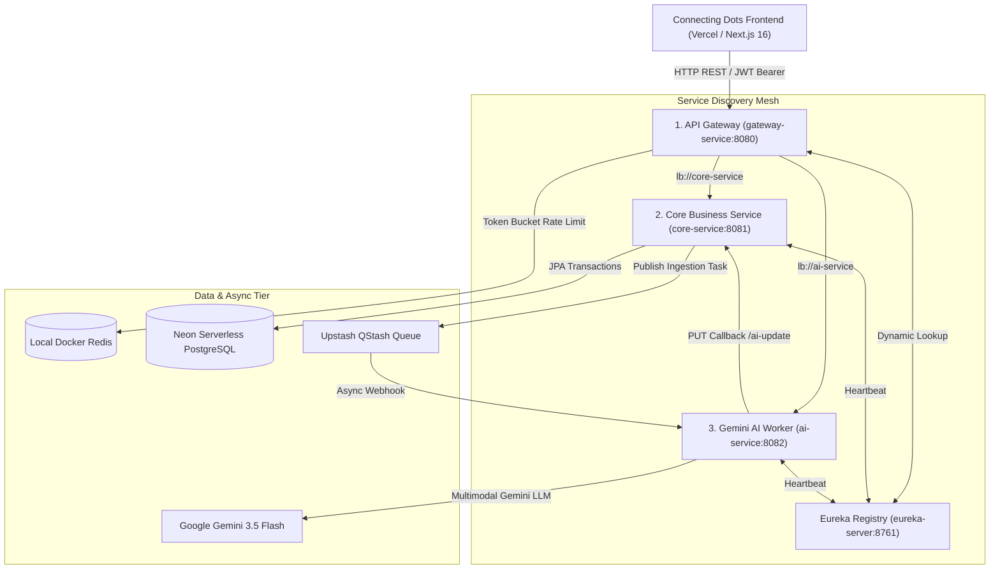

# Connecting Dots V2 — AI-Powered Civic Tech Platform


---

> [!IMPORTANT]
> ### ☁️ Live Cloud Hosting & Cold-Start Disclaimer
> 
> * **Frontend Deployment**: Hosted on **Vercel**.
> * **Backend Microservices Deployment**: Hosted on **Render** (Free Tier).
> 
> **Cold-Start Notice**: Free-tier cloud microservices on Render automatically spin down after 15 minutes of inactivity. When visiting the live application for the first time or after a period of inactivity, initial API requests may take **30 to 60 seconds** while backend containers complete their boot sequence.
> 
> The application includes a live status banner (`BackendStatusBanner`) that monitors service connection states. **Please wait for all microservices to finish warming up before logging in or submitting forms.**

---

## 🌐 1. Platform Overview

**Connecting Dots V2** is an enterprise-grade, microservices-driven civic technology platform engineered to match Non-Governmental Organizations (NGOs) with technical volunteer contributors (software engineers, data scientists, UX designers).

### The Core Problem & AI Solution

Grassroots NGOs frequently struggle to translate real-world community needs into structured technical project briefs. Connecting Dots solves this by enabling NGOs to upload raw field notes, paper photographs, PDFs, or audio recordings in **any language**.

An asynchronous AI processing pipeline powered by **Google Gemini 3.5 Flash** transcribes, translates, and structures raw uploads into actionable engineering problem statements exposed on a public marketplace for technical contributors.

---

## 🏛️ 2. Microservices System Architecture

The platform is architected around a **decoupled 4-microservice backend** paired with a **Next.js 16 App Router frontend**:


```mermaid
flowchart TD
    Client["Connecting Dots Frontend (Vercel / Next.js 16)"] -->|HTTP REST / JWT Bearer| GW["1. API Gateway (gateway-service:8080)"]

    subgraph ServiceDiscoveryMesh["Service Discovery Mesh"]
        Eureka["Eureka Registry (eureka-server:8761)"]
        GW <-->|Dynamic Lookup| Eureka
        GW -->|lb://core-service| Core["2. Core Business Service (core-service:8081)"]
        GW -->|lb://ai-service| AI["3. Gemini AI Worker (ai-service:8082)"]
        Core <-->|Heartbeat| Eureka
        AI <-->|Heartbeat| Eureka
    end

    subgraph DataAsyncTier["Data & Async Tier"]
        GW -->|Token Bucket Rate Limit| Redis[("Local Docker Redis")]
        Core -->|JPA Transactions| DB[("Neon Serverless PostgreSQL")]
        Core -->|Publish Ingestion Task| QStash["Upstash QStash Queue"]
        QStash -->|Async Webhook| AI
        AI -->|Multimodal Gemini LLM| Gemini["Google Gemini 3.5 Flash"]
        AI -->|PUT Callback /ai-update| Core
    end
```

---

## 📊 3. Microservice Architecture Matrix

Detailed technical documentation for each component is available in its respective folder:

| Component / Service | Port | Primary Responsibilities | Detailed Documentation |
| :--- | :--- | :--- | :--- |
| **`connecting-dots-frontend`** | `3000` | Next.js 16 App Router, React 19 UI, Tailwind CSS v4, dynamic status banner. | 👉 [Frontend README](connecting-dots-frontend/README.md) |
| **`gateway-service`** | `8080` | Edge entry point, route predicates (`lb://`), Redis rate limiting, CORS policy. | 👉 [Gateway README](connecting-dots-backend/gateway-service/GATEWAY_SERVICE_README.md) |
| **`core-service`** | `8081` | Auth (JWT/BCrypt), NGO & Contributor profiles, application state machine, messaging threads. | 👉 [Core Service README](connecting-dots-backend/core-service/CORE_SERVICE_README.md) |
| **`ai-service`** | `8082` | Multimodal document extraction, Gemini 3.5 Flash LLM, async QStash webhook processing. | 👉 [AI Service README](connecting-dots-backend/ai-service/AI_SERVICE_README.md) |
| **`eureka-server`** | `8761` | Netflix Eureka dynamic service discovery registry & instance health directory. | 👉 [Eureka README](connecting-dots-backend/eureka-server/EUREKA_SERVER_README.md) |

---

## 🚀 4. Local Quickstart & Development Guide

### Prerequisites

* **Docker** & **Docker Compose** installed on your system.
* **Node.js** v20+ & **Java 25 JDK** (for standalone local development).

---

### Option A: Full-Stack Local Execution (Docker Compose)

To build and run all services (Frontend, Gateway, Core, AI, Eureka, Redis) in unified Docker containers:

```bash
docker compose up --build
```

#### Access Points

* **Next.js Frontend**: `http://localhost:3000`
* **API Gateway**: `http://localhost:8080`
* **Eureka Registry Dashboard**: `http://localhost:8761`

---

### Option B: Local PowerShell Management Scripts (Windows)

For rapid local testing on Windows systems using PowerShell:

#### Start All Local Services
```powershell
.\start-system.ps1
```

#### Stop All Local Services
```powershell
.\stop-system.ps1
```

---

## 🔑 5. Seeded Demo Accounts

The database includes pre-seeded accounts for instant platform testing:

| Role | Email | Password | Permissions & Features |
| :--- | :--- | :--- | :--- |
| **Admin** | `admin@connectingdots.org` | `Admin@1234` | Platform Governance, NGO Verification & Metrics |
| **NGO** | `ngo_test@connectingdots.org` | `Ngo@1234` | Problem Creation, AI Document Ingestion & Matching |
| **Contributor** | `contributor_test@connectingdots.org` | `Contributor@1234` | Project Exploration, Applying & 1-on-1 Messaging |

---

## 📁 6. Streamlined Repository Structure

```
Connecting-Dots-V2/
├── connecting-dots-frontend/            # Next.js 16 Frontend App Router
│   ├── app/                            # App Routes (admin, ngo, contributor, profile)
│   ├── components/                     # Civic-Tech UI Components & Status Banner
│   ├── lib/                            # Bearer Token API Client & Upload Helpers
│   └── README.md                       # Detailed Frontend Documentation
├── connecting-dots-backend/
│   ├── eureka-server/                  # Service Discovery Server (:8761)
│   ├── gateway-service/                # Edge API Gateway & Rate Limiter (:8080)
│   ├── core-service/                   # Core Business API & Database Persistence (:8081)
│   ├── ai-service/                     # Gemini 3.5 Flash Ingestion Worker (:8082)
│   └── BACKEND_ARCHITECTURE.md         # Master Backend Microservices Blueprint
├── Sample Problems/                    # Sample Ingestion Files (PDFs, notes, images)
├── docker-compose.yml                  # Full-Stack Orchestration Manifest
├── start-system.ps1                    # Local System Launch Script
├── stop-system.ps1                     # Local System Termination Script
├── ARCHITECTURE_DECISIONS_AND_SOLUTIONS.md # Architectural Design & Tradeoffs Doc
└── README.md                           # Master Project Readme
```

---

## 📄 7. License

Distributed under the MIT License. Built for social impact.
