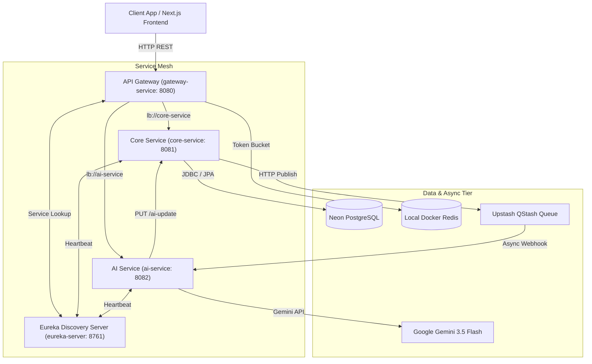

# Connecting Dots - Microservices Backend Architecture & Technical Guide

Welcome to the enterprise microservices architecture guide for **Connecting Dots**. This document serves as the master blueprint for understanding how the backend is structured, how data flows across microservices, how containers are orchestrated, and how to explain this project in technical interviews.

---

## 1. System Overview

**Connecting Dots** is a social impact platform connecting grassroots Non-Governmental Organizations (NGOs) with technical contributors (software engineers, data scientists, designers). 

NGOs upload unstructured problem statements (such as PDFs, documents, or raw text descriptions). The backend ingests these files, delegates document parsing asynchronously to a dedicated AI microservice powered by Google Gemini LLM, structures the problem into clean categories, and exposes it on a public discovery marketplace for contributors to solve.

---

## 2. Directory & Folder Structure

```text
connecting-dots-backend/
├── eureka-server/                     # Service Registry & Discovery Server
│   ├── Dockerfile
│   ├── EUREKA_SERVER_README.md        # Detailed Eureka Service Guide
│   ├── pom.xml
│   └── src/main/java/com/connectingdots/eurekaserver/
│
├── gateway-service/                   # API Gateway & Edge Router
│   ├── Dockerfile
│   ├── GATEWAY_SERVICE_README.md      # Detailed Gateway Service Guide
│   ├── pom.xml
│   └── src/main/java/com/connectingdots/gateway_service/
│
├── core-service/                      # Main Business Logic & Database Service
│   ├── Dockerfile
│   ├── CORE_SERVICE_README.md         # Detailed Core Service Guide
│   ├── pom.xml
│   └── src/main/java/com/connectingdots/core_service/
│
├── ai-service/                        # Gemini AI Processing & Async Webhook Service
│   ├── Dockerfile
│   ├── AI_SERVICE_README.md           # Detailed AI Service Guide
│   ├── pom.xml
│   └── src/main/java/com/connectingdots/ai_service/
│
├── BACKEND_ARCHITECTURE.md            # Master Architecture & Technical Guide
└── restart-system.ps1                 # Local Environment Management Script
```

---

## 3. Microservices Component Breakdown

| Service | Port | Primary Responsibility | Tech Stack |
| :--- | :--- | :--- | :--- |
| **`eureka-server`** | `8761` | Dynamic service registration and heartbeat health registry. | Spring Cloud Netflix Eureka |
| **`gateway-service`** | `8080` | Single edge entry point, routing (`lb://`), CORS, JWT pre-validation, and Redis rate limiting. | Spring Cloud Gateway (WebFlux / Netty), Redis |
| **`core-service`** | `8081` | User management, Auth, NGO & Contributor Profiles, Applications, Messaging, and Flyway database migrations. | Spring Boot 4, Spring Security, Neon PostgreSQL, Flyway |
| **`ai-service`** | `8082` | Heavyweight AI document parsing, Gemini LLM structuring, and language translation. | Spring AI 2.0.0, Google GenAI SDK, Upstash QStash |

---

## 4. Architecture Diagram & Asynchronous Data Flow

### Architecture Topology



### End-to-End Async AI Parsing Flow

1. **Upload Request**: NGO submits a problem statement with a document URL to `core-service` via Gateway (`POST /api/v1/core/problem-statements`).
2. **Instant Persistence**: `core-service` saves the record in Neon PostgreSQL with status `PROCESSING` and returns HTTP `201 Created` immediately.
3. **Queue Publishing**: `core-service` publishes a background task payload to Upstash QStash HTTP queue.
4. **Async Webhook Trigger**: QStash executes an asynchronous HTTP POST webhook request to `ai-service` (`POST /api/v1/ai/webhook`).
5. **AI Extraction**: `ai-service` uses Spring AI `ChatClient` with Google Gemini 3.5 Flash to extract title, description, domain, and tags.
6. **Callback Update**: `ai-service` calls back `core-service` (`PUT /api/v1/core/problem-statements/{id}/ai-update`) to update the record status to `OPEN`.

---

## 5. Architectural Choices Explained (Plain Language)

1. **Why Microservices over a Monolith?**
   - AI document processing and Gemini LLM calls take several seconds and are CPU/memory intensive. By isolating AI processing in `ai-service`, heavy processing spikes never slow down user logins, messaging, or browsing in `core-service`.

2. **Why Asynchronous Queue (QStash) for AI Tasks?**
   - Synchronous HTTP requests timing out after 30 seconds lead to poor user experience. Offloading tasks to QStash guarantees execution retry resilience while giving the user instant UI response.

3. **Why Local Redis Container for Rate Limiting?**
   - Using a local Redis container in `docker-compose.yml` (`REDIS_HOST=redis-cache`) ensures low-latency token-bucket rate limiting without network latency overhead.

4. **Why Centralized Master Environment Variables?**
   - Consolidating all microservice secrets into a single root `.env` prevents credential drift and simplifies container orchestration via Docker Compose.

---

## 6. Containerization & Orchestration

The backend services are containerized via Docker and orchestrated using `docker-compose.yml`:

```yaml
version: '3.8'

services:
  eureka-server:   # Port 8761
  redis-cache:     # Port 6379 (Redis 7 Alpine)
  gateway-service: # Port 8080
  core-service:    # Port 8081
  ai-service:      # Port 8082
```

All microservices share a virtual bridge network (`connecting-dots-network`) and inherit environment configuration from root `.env`.

---

## 7. How the Backend Fits into the Bigger Picture

- **Frontend Integration**: Next.js 14 frontend communicates exclusively through `gateway-service` on port `8080`.
- **Security & Authorization**: JWT tokens generated during login carry user roles (`ROLE_CONTRIBUTOR`, `ROLE_NGO`, `ROLE_ADMIN`). Public guest discovery endpoints are accessible without tokens (`permitAll()`), while write mutations enforce 401 Unauthorized for anonymous requests.
- **Messaging Threads**: Application messages are isolated per `application_id`, enabling an NGO to converse separately with different assigned contributors across multiple problem statements.

---

## 8. Key Engineering Challenges & Technical Solutions

A detailed breakdown of system design decisions, edge-case solutions, and technical trade-offs across the microservices architecture is documented in the master guide:
👉 **[ARCHITECTURE_DECISIONS_AND_SOLUTIONS.md](../ARCHITECTURE_DECISIONS_AND_SOLUTIONS.md)**
