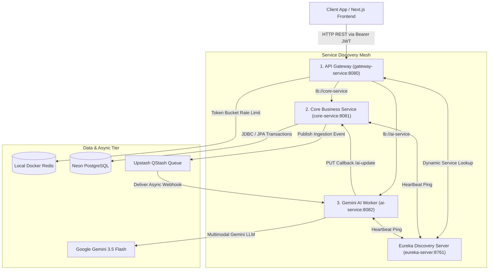
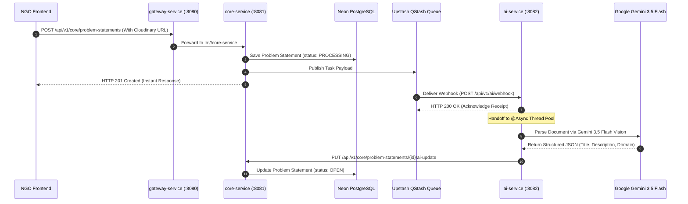

# Connecting Dots V2 — Master Microservices Backend Architecture

Welcome to the master technical architecture guide for **Connecting Dots V2**. This document provides an executive blueprint of the 4-microservice backend architecture, detailing service interaction patterns, security boundaries, database structures, and asynchronous data flows.

---

## 1. System Topology & Architecture Overview

Connecting Dots V2 is built around a decoupled **4-microservice backend architecture** engineered for scalable civic technology matching between NGOs and technical contributors.

---

## 2. Microservice Matrix

| Service Name | Port | Primary Responsibilities | Core Technologies |
| :--- | :--- | :--- | :--- |
| **`eureka-server`** | `8761` | Dynamic service registration, instance health tracking, and phonebook directory. | Spring Cloud Netflix Eureka |
| **`gateway-service`** | `8080` | Single public entry point, route predicates (`lb://`), Redis rate limiting, and CORS security. | Spring Cloud Gateway, Redis 7 |
| **`core-service`** | `8081` | Authentication, domain entities, project application state machine, application chat threads, Flyway migrations. | Spring Boot 4, Spring Security, Neon PostgreSQL, Flyway |
| **`ai-service`** | `8082` | Multimodal document parsing (PDFs, notes), domain structuring, regional language translation, and callback updates. | Spring AI 2.0.0, Google Gemini 3.5 Flash, Upstash QStash |

---

## 3. End-to-End Asynchronous Ingestion Data Flow

---

## 4. Key Architectural Patterns & Decisions

### 1. Edge Gateway & Reactive Rate Limiting
All external request traffic enters through `gateway-service` on port `8080`. Downstream microservices (`8081`, `8082`) are isolated from direct external internet traffic. Redis token-bucket rate limiting enforces a limit of 10 requests per second with a burst capacity of 20 per client IP.

### 2. Isolated Asynchronous AI Processing
Document parsing and Gemini 3.5 Flash LLM calls take several seconds to execute. Placing AI extraction inside `ai-service` triggered via Upstash QStash webhooks ensures main user workflows (login, messaging, browsing) remain ultra-fast and unblocked.

### 3. Application State Machine Integrity
`core-service` enforces strict state transitions:
* Accepting an application sets problem status to `IN_PROGRESS` and **automatically sets all other pending applications for that problem to `REJECTED`**.
* If an accepted application is withdrawn or rejected, the problem status **reverts back to `OPEN`** if no other accepted application remains.
* Contributors with `WITHDRAWN` or `REJECTED` applications can re-apply once the problem opens up again.

---

## 5. Service README Directory

Detailed technical documentation for each microservice is maintained within its respective project folder:

* **Service Discovery**: 👉 [EUREKA_SERVER_README.md](eureka-server/EUREKA_SERVER_README.md)
* **API Gateway**: 👉 [GATEWAY_SERVICE_README.md](gateway-service/GATEWAY_SERVICE_README.md)
* **Core Business Service**: 👉 [CORE_SERVICE_README.md](core-service/CORE_SERVICE_README.md)
* **AI Ingestion Worker**: 👉 [AI_SERVICE_README.md](ai-service/AI_SERVICE_README.md)
