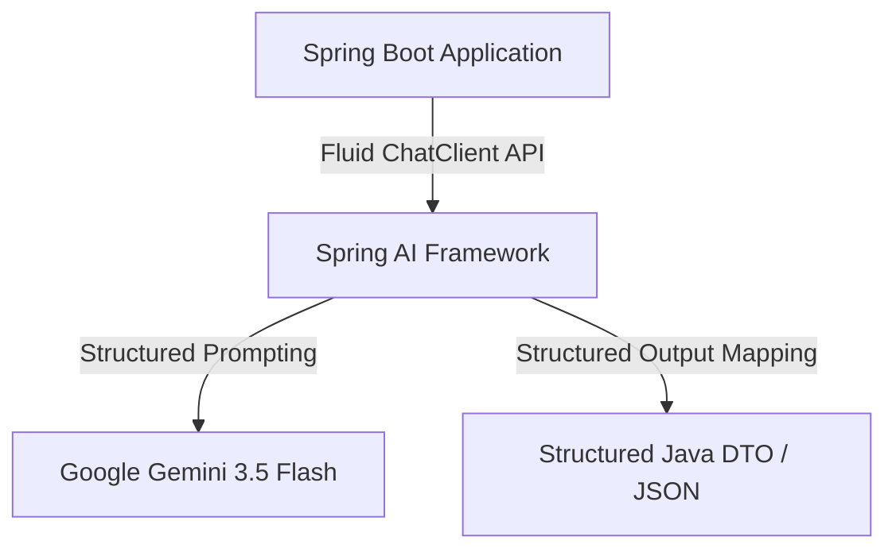
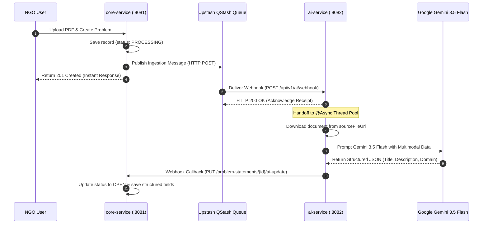

# Gemini AI Microservice (`ai-service`)

The `ai-service` microservice is an asynchronous processing worker responsible for artificial intelligence operations within the Connecting Dots platform. Powered by **Spring AI 2.0.0** and **Google Gemini 3.5 Flash**, it parses unstructured documents (PDFs, handwritten notes, audio transcripts) uploaded by NGOs and structures them into actionable engineering briefs.

---

## 1. What is Spring AI & Asynchronous LLM Processing?

### Understanding Spring AI

**Spring AI** is an enterprise framework that provides portable, model-agnostic abstractions for integrating Generative Artificial Intelligence (GenAI) models into Spring applications. Similar to how Spring Data abstracts SQL databases, Spring AI abstracts Large Language Models (LLMs) via unified interfaces such as `ChatClient` and `Prompt`.



### Why Decouple AI Processing into a Worker Service?

Large Language Model (LLM) operations and multimodal document parsing take several seconds to execute. Performing these operations synchronously inside main web controllers leads to request timeouts, blocked server threads, and poor user experience.

Decoupling AI operations into an **asynchronous worker service** provides:

* **Non-Blocking Architecture**: Web API controllers respond immediately (`201 Created` / `200 OK`), while heavy processing runs in background threads.
* **Fault Isolation**: High CPU or memory consumption during document extraction does not slow down user logins, messaging, or browsing in `core-service`.
* **Retry Resilience**: Queueing tasks allows failed processing attempts to be automatically retried without dropping user requests.

---

## 2. Implementation in Connecting Dots V2

In Connecting Dots V2, `ai-service` runs on port `8082` and handles document parsing, domain classification, regional language translation, and automated problem structuring.

> [!NOTE]
> `ai-service` does not expose direct public web UI endpoints. It functions as an event-driven worker triggered by **Upstash QStash** HTTP webhooks.

### Asynchronous AI Ingestion Pipeline



---

## 3. Data Payloads & Sequence Specifications

### 1. Ingestion Message Payload (Input from QStash)

When an NGO uploads a file, `core-service` sends this event payload to QStash, which delivers it to `ai-service`:

```json
{
  "problemId": "c4a3b8d1-1234-5678-9abc-def123456789",
  "sourceFileUrl": "https://res.cloudinary.com/demo/image/upload/v1/problem_notes.pdf",
  "sourceType": "PDF"
}
```

### 2. AI Update Callback Payload (Output to `core-service`)

After Gemini 3.5 Flash processes the document, `ai-service` sends the structured output back to `core-service`:

```json
{
  "title": "Solar Powered Water Filtration System for Rural Schools",
  "description": "Comprehensive brief detailing low-cost filtration setup, maintenance guidelines, and local sensor monitoring requirements.",
  "domain": "Sustainability",
  "tags": ["water-filtration", "solar-power", "iot-monitoring"]
}
```

---

## 4. Key Components & Code Implementation

### Asynchronous Handoff Controller (`AiController.java`)

`AiController` receives the webhook, acknowledges receipt to QStash instantly, and delegates heavy parsing to an `@Async` background worker thread:

```java
@RestController
@RequestMapping("/api/v1/ai")
@RequiredArgsConstructor
public class AiController {

    private final AiProcessingService aiProcessingService;

    @PostMapping("/webhook")
    public ResponseEntity<String> handleQStashWebhook(@RequestBody IngestionMessage message) {
        // Asynchronous execution releases HTTP connection immediately
        aiProcessingService.processFileAndExtractProblem(message);
        return ResponseEntity.ok("Webhook received and asynchronous processing initiated.");
    }
}
```

### Async Worker & Gemini Integration (`AiProcessingService.java`)

```java
@Service
@RequiredArgsConstructor
public class AiProcessingService {

    private final RestClient restClient = RestClient.create();

    @Value("${gemini.api.key}")
    private String geminiApiKey;

    @Async
    public void processFileAndExtractProblem(IngestionMessage message) {
        // 1. Initialize Google GenAI Client
        Client client = Client.builder().apiKey(geminiApiKey).build();

        // 2. Invoke Gemini 3.5 Flash LLM for structured extraction
        String prompt = "Analyze this document and output JSON with keys: title, description, domain, tags.";
        GenerateContentResponse response = client.models.generateContent(
            "gemini-3.5-flash",
            prompt,
            null
        );

        // 3. Callback update to core-service
        restClient.put()
            .uri("http://core-service:8081/api/v1/core/problem-statements/" + message.getProblemId() + "/ai-update")
            .header("X-Internal-Service-Secret", System.getenv("INTERNAL_SERVICE_SECRET"))
            .body(extractedPayload)
            .retrieve()
            .toBodilessEntity();
    }
}
```

---

## 5. Technical Specifications

| Parameter | Specification |
| :--- | :--- |
| **Port** | `8082` |
| **Runtime Environment** | Java 25 |
| **Framework** | Spring Boot 4.0.7 & Spring AI 2.0.0 |
| **AI Client SDK** | Google GenAI SDK (`com.google.genai`) |
| **AI Model Target** | `gemini-3.5-flash` |
| **Asynchronous Engine** | Spring `@Async` Thread Pool Execution |
| **Queue & Retry Engine** | Upstash QStash Serverless Webhook Queue |
| **REST Client** | Spring 6 `RestClient` |
