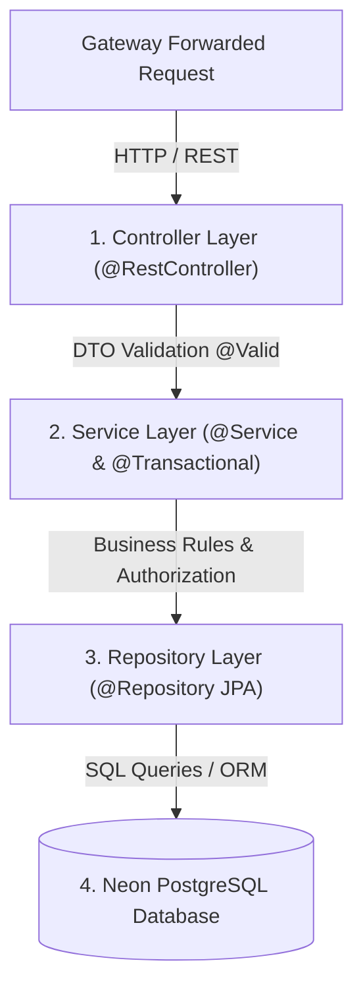

# ⚙️ Core Business Microservice (`core-service`)

The `core-service` microservice is the central transactional engine of the Connecting Dots platform. It manages user authentication, NGO and contributor profiles, problem statement lifecycles, project applications, application-isolated chat messaging threads, and community reviews.

---

## 🏗️ 1. What is Core Business Logic in Spring Boot Architecture?

In an enterprise microservices ecosystem, the **Core Service** encapsulates the domain data models, business rules, security authorization boundaries, and transactional persistence logic.

Spring Boot enforces a clean **Layered Architecture** pattern to separate web concerns from business rules and data persistence:



### Key Architectural Layers

* **🎮 Controller Layer (`@RestController`)**: Handles HTTP requests, validates DTO payloads (`@Valid`), extracts SecurityContext claims, and maps response DTOs.
* **🧠 Service Layer (`@Service`)**: Encapsulates core business rules, enforces role authorization checks, wraps multi-step updates in database transactions (`@Transactional`), and triggers external integration events.
* **🗄️ Repository Layer (`@Repository`)**: Interfaces with Spring Data JPA and Hibernate to execute type-safe SQL queries against the relational database.
* **💾 Database Layer**: Manages persistent domain entities (`User`, `ProblemStatement`, `Application`, `Message`) with ACID compliance.

---

## ⚙️ 2. Implementation in Connecting Dots V2

In Connecting Dots V2, `core-service` runs on port `8081` and connects to a serverless **Neon PostgreSQL** database with **Flyway** schema versioning.

> [!NOTE]
> `core-service` serves as the authoritative source of truth for platform state, user accounts, security tokens, and project lifecycle transitions.

### 🔄 Application Lifecycle State Machine

The core service manages complex status transitions across problem statements and project applications.

```mermaid
stateDiagram-v2
    [*] --> OPEN: NGO Uploads & AI Ingests Problem
    
    state OPEN {
        [*] --> PENDING: Contributor Applies
        PENDING --> WITHDRAWN: Contributor Withdraws
        WITHDRAWN --> PENDING: Contributor Re-applies
    }
    
    OPEN --> IN_PROGRESS: NGO Accepts an Application
    
    state IN_PROGRESS {
        note right of IN_PROGRESS
            Accepting 1 application automatically
            sets all other PENDING apps to REJECTED.
        end note
        ACCEPTED --> WITHDRAWN: Contributor Withdraws
        ACCEPTED --> REJECTED: NGO Rejects
    }
    
    IN_PROGRESS --> OPEN: All Accepted Apps Withdrawn / Rejected
    
    IN_PROGRESS --> CLOSED: NGO Marks Application Completed
    CLOSED --> [*]
```

### Business Logic Highlights

#### 1. Auto-Rejection & State Reversion Logic

* **Accepting an Application**: When an NGO accepts one contributor's application, `ApplicationService` updates that application to `ACCEPTED`, sets the Problem Statement status to `IN_PROGRESS`, and **automatically sets all other pending applications for that problem to `REJECTED`**.
* **Reverting to Open**: If an accepted application is withdrawn or rejected, `ApplicationService` checks if any remaining accepted application exists. If none remain, the Problem Statement status **automatically reverts back to `OPEN`**.
* **Re-applying**: When a problem statement opens up again, contributors with `WITHDRAWN` or `REJECTED` statuses can re-apply. The backend reactivates their existing record back to `PENDING`.

#### 2. Application-Isolated Chat Threads

Chat messages are bound directly to a specific `application_id` in the `application_messages` table:

```
Application 1 (Problem A + Contributor 1) ──> Thread app-uuid-1 (Isolated)
Application 2 (Problem A + Contributor 2) ──> Thread app-uuid-2 (Isolated)
```

`MessageService` validates that the message sender is either the applicant contributor or the NGO owner tied to that specific application ID, ensuring full thread privacy.

---

## 🗺️ 3. Endpoints & API Matrix

| HTTP Method | Endpoint Path | Role Required | Description |
| :--- | :--- | :--- | :--- |
| `POST` | `/api/v1/core/auth/register` | `permitAll()` | Registers user (`NGO` or `CONTRIBUTOR`) & issues JWT token. |
| `POST` | `/api/v1/core/auth/login` | `permitAll()` | Validates credentials & issues JWT token. |
| `GET` | `/api/v1/core/problem-statements` | `permitAll()` | Public exploration of open problem statements (paged/filtered). |
| `POST` | `/api/v1/core/problem-statements` | `NGO` Role | Creates problem statement & triggers QStash ingestion. |
| `GET` | `/api/v1/core/profiles/ngos` | `permitAll()` | Public directory of NGO profiles. |
| `GET` | `/api/v1/core/profiles/contributors` | `permitAll()` | Public directory of Contributor profiles. |
| `POST` | `/api/v1/core/applications` | `CONTRIBUTOR` Role | Submits application for a problem statement. |
| `PUT` | `/api/v1/core/applications/{id}/status` | NGO / Contributor | Updates application status (`ACCEPTED`, `REJECTED`, `WITHDRAWN`). |
| `PUT` | `/api/v1/core/applications/{id}/complete` | `NGO` Role | Marks application complete & increments completed projects stat. |
| `GET` | `/api/v1/core/applications/{id}/messages` | Participant | Retrieves thread-isolated messages for an application. |
| `POST` | `/api/v1/core/applications/{id}/messages` | Participant | Sends thread-isolated message. |
| `GET` | `/api/v1/core/admin/stats` | `ADMIN` Role | Retrieves platform-wide counters (Users, NGOs, Problems, Apps). |
| `PUT` | `/api/v1/core/admin/ngos/{id}/verify` | `ADMIN` Role | Toggles NGO verification status (`isVerified`). |
| `DELETE` | `/api/v1/core/admin/problems/{id}` | `ADMIN` Role | Deletes problem statement and cascades deletion to applications & messages. |

---

## 📁 4. Flyway Database Versioning Schema

Flyway manages database migrations incrementally on service startup:

```
src/main/resources/db/migration/
├── V1__init_schema.sql                      # Base schema (users, ngo_profiles, contributor_profiles, problem_statements)
├── V4__create_applications_table.sql        # Applications state table
├── V5__create_messages_table.sql            # Application-isolated chat threads
├── V7__add_completed_projects_counter.sql   # Contributor reputation counters
├── V8__create_reviews_table.sql             # 1-5 star review ratings table
├── V9__add_is_verified_to_ngo_profiles.sql  # NGO trust verification column
└── V10__seed_default_admin_user.sql         # Seed default admin user (admin@connectingdots.org)
```

---

## 📊 5. Technical Specifications

| Parameter | Specification |
| :--- | :--- |
| **Port** | `8081` |
| **Runtime Environment** | Java 25 |
| **Framework** | Spring Boot 4.0.7 / Spring Security |
| **Persistence Engine** | Spring Data JPA / Hibernate |
| **Relational Database** | Neon Serverless PostgreSQL |
| **Database Migrations** | Flyway (`V1` – `V10`) |
| **Authentication & Tokens** | JJWT (`io.jsonwebtoken` 0.12.x) & BCrypt |
| **File Cloud Storage** | Cloudinary Java SDK |
