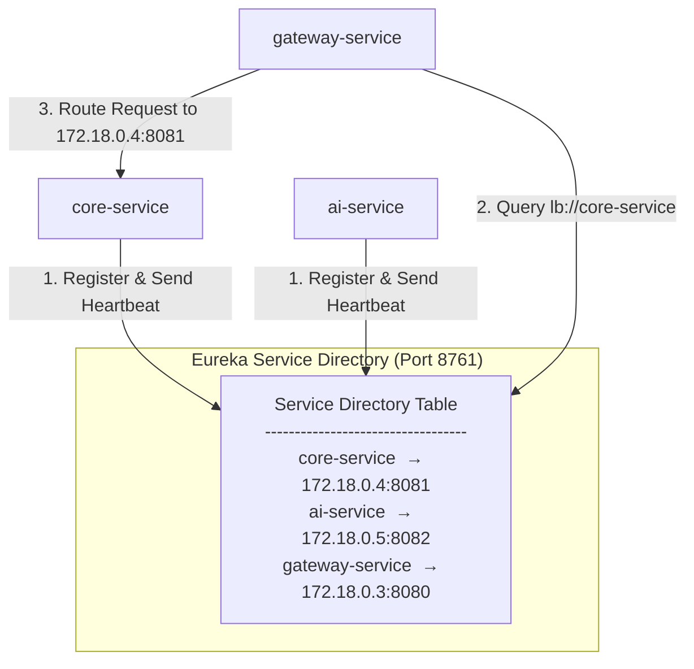
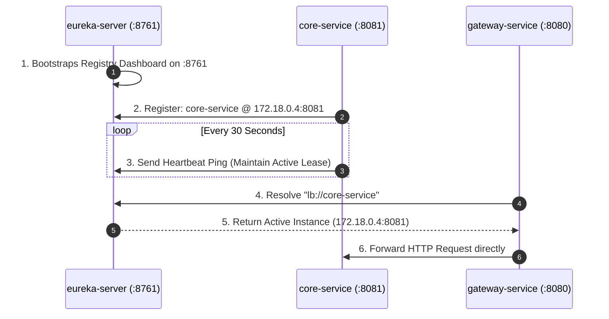

# 🌐 Eureka Service Discovery Server (`eureka-server`)

The `eureka-server` microservice functions as the centralized **Service Registry & Phonebook Directory** for the Connecting Dots microservices architecture. Powered by **Spring Cloud Netflix Eureka Server**, it enables dynamic microservice discovery, allowing services to locate and communicate with each other seamlessly without hardcoded IP addresses or domain names.

---

## 🔍 1. What is Service Discovery & Eureka Server?

### ⚠️ The Challenge of Dynamic Environments

In modern cloud and containerized environments (such as Docker Compose, Kubernetes, or Render), microservice instances are dynamic. Containers are frequently created, restarted, or auto-scaled, causing their IP addresses to change unpredictably.

Hardcoding IP addresses or static URLs into microservice configuration files creates brittle architectures that break whenever a container restarts.

### 💡 The Service Discovery Solution

A **Service Discovery Registry** acts as a dynamic phonebook directory:

1. **Registration**: Every microservice registers its network location (IP address, port, service name) with the registry upon startup.
2. **Lookup**: Microservices query the registry to discover the real-time network location of other services.



---

## ⚙️ 2. Implementation in Connecting Dots V2

In Connecting Dots V2, `eureka-server` runs on port `8761` and hosts an interactive web dashboard at `http://localhost:8761`.

> [!NOTE]
> `eureka-server` is configured purely as a server registry node: it does not register with itself or fetch remote registries.

### 🔄 Service Registration & Lookup Lifecycle



---

## 🚀 3. Core Mechanics & Key Concepts

* **`@EnableEurekaServer`**: Annotation on `EurekaServerApplication.java` that initializes the Netflix Eureka Server endpoints and dashboard UI.
* **💓 Heartbeat Pings**: Microservices send heartbeat pings every 30 seconds to maintain an active lease in the registry.
* **⏱️ Lease Eviction**: If a service fails to send a heartbeat within 90 seconds, Eureka marks the lease expired and removes the instance from the directory.
* **🛡️ Self-Preservation Mode**: A safety mechanism where Eureka temporarily halts instance evictions if a sudden network outage prevents multiple instances from reaching the server, protecting against cascading failures.

---

## 📝 4. Configuration Details (`application.yml`)

```yaml
server:
  port: 8761

spring:
  application:
    name: eureka-server

eureka:
  client:
    register-with-eureka: false  # Registry server does not register as a client to itself
    fetch-registry: false        # Registry server does not need to fetch remote registries
  server:
    wait-time-in-ms-when-sync-empty: 0
```

---

## 📊 5. Technical Specifications

| Parameter | Specification |
| :--- | :--- |
| **Port** | `8761` |
| **Dashboard URL** | `http://localhost:8761` |
| **Runtime Environment** | Java 25 |
| **Framework** | Spring Boot 4.0.7 / Spring Cloud 2025.1.2 |
| **Discovery Engine** | Spring Cloud Netflix Eureka Server |
| **Heartbeat Frequency** | 30 Seconds |
| **Lease Expiration Threshold** | 90 Seconds |
