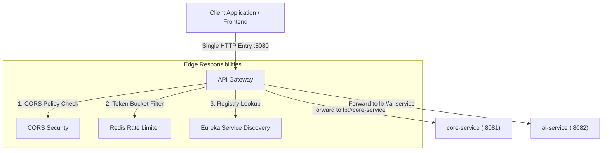
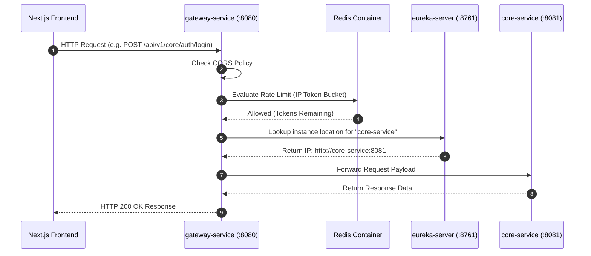

# 🛡️ API Gateway Microservice (`gateway-service`)

The `gateway-service` microservice acts as the single **Edge Entry Point** for the Connecting Dots microservices architecture. Built on reactive, non-blocking Spring Cloud Gateway, it controls traffic entry, enforces rate limiting, handles CORS security, and dynamically routes client requests to backend services.

---

## 🌐 1. What is an API Gateway?

In a microservices architecture, client applications (such as web frontends or mobile apps) require access to multiple backend services. Directly exposing every microservice to the internet creates security vulnerabilities, CORS complications, and client-side coupling.

An **API Gateway** solves these challenges by acting as a reverse proxy and unified edge server.



### Core Responsibilities of an API Gateway

* **🎯 Unified Routing**: Exposes a single public IP and port, mapping incoming endpoint paths to internal microservices.
* **⚡ Traffic Control & Rate Limiting**: Protects downstream microservices from traffic surges and Denial-of-Service (DoS) attacks by throttling request rates per IP.
* **🔐 Security & CORS Enforcement**: Handles Cross-Origin Resource Sharing policies in one central place instead of duplicating headers across every microservice.
* **🔄 Dynamic Load Balancing**: Queries service registries (like Eureka) to resolve logical service names (`lb://service-name`) into container IP addresses.

---

## ⚙️ 2. Implementation in Connecting Dots V2

In the Connecting Dots ecosystem, `gateway-service` runs as a high-throughput, non-blocking reactive server powered by **Spring Cloud Gateway** and **Project Reactor (Netty)** on port `8080`.

> [!NOTE]
> All incoming frontend requests from Next.js target port `8080`. External clients never communicate directly with `core-service` (`8081`) or `ai-service` (`8082`).

### 🔄 System Architecture Flow



---

## 🗺️ 3. Route Mapping Matrix

The gateway maps incoming requests using path-based predicates and forwards them using Spring Cloud Eureka load balancer URIs (`lb://` scheme):

| External Path Pattern | Logical Route URI | Target Microservice | Function |
| :--- | :--- | :--- | :--- |
| `/api/v1/core/auth/**` | `lb://core-service` | `core-service` | User Registration & JWT Login |
| `/api/v1/core/problem-statements/**` | `lb://core-service` | `core-service` | Problem Statement Ingestion & Discovery |
| `/api/v1/core/applications/**` | `lb://core-service` | `core-service` | Project Applications & 1-on-1 Chat Threads |
| `/api/v1/core/profiles/**` | `lb://core-service` | `core-service` | NGO & Contributor Profile Management |
| `/api/v1/core/admin/**` | `lb://core-service` | `core-service` | Admin Governance & Verification |
| `/api/v1/ai/webhook` | `lb://ai-service` | `ai-service` | Asynchronous Gemini AI Webhook Processing |

---

## 🔒 4. Key Configurations & Rate Limiting

### Reactive Redis Token-Bucket Rate Limiter

`gateway-service` enforces rate limiting using Spring Data Reactive Redis. Requests are evaluated per client IP address.

* **Replenish Rate**: 10 requests per second.
* **Burst Capacity**: 20 requests.
* **Key Resolver**: Resolves client IP address (`#{@ipKeyResolver}`).

> [!IMPORTANT]
> If a client exceeds the burst capacity threshold of 20 requests within a second, the gateway immediately returns `HTTP 429 Too Many Requests`, safeguarding backend microservices from resource exhaustion.

#### IP Key Resolver Implementation (`GatewayConfig.java`)

```java
@Configuration
public class GatewayConfig {

    @Bean
    public KeyResolver ipKeyResolver() {
        return exchange -> Mono.just(
            exchange.getRequest().getRemoteAddress() != null ?
            exchange.getRequest().getRemoteAddress().getAddress().getHostAddress() : "anonymous"
        );
    }
}
```

#### Gateway Routing & Filter Configuration (`application.yml`)

```yaml
server:
  port: 8080

spring:
  application:
    name: gateway-service
  cloud:
    gateway:
      routes:
        - id: core-service-route
          uri: lb://core-service
          predicates:
            - Path=/api/v1/core/**
          filters:
            - name: RequestRateLimiter
              args:
                redis-rate-limiter.replenishRate: 10
                redis-rate-limiter.burstCapacity: 20
                key-resolver: "#{@ipKeyResolver}"

        - id: ai-service-route
          uri: lb://ai-service
          predicates:
            - Path=/api/v1/ai/**

eureka:
  client:
    service-url:
      defaultZone: http://eureka-server:8761/eureka/
```

---

## 📊 5. Technical Specifications

| Parameter | Specification |
| :--- | :--- |
| **Port** | `8080` |
| **Runtime Environment** | Java 25 |
| **Framework** | Spring Boot 4.0.7 / Spring Cloud Gateway |
| **Reactor Engine** | Netty (Non-Blocking Reactive I/O) |
| **Cache & Rate Limit Store** | Redis 7 Alpine |
| **Discovery Client** | Spring Cloud Netflix Eureka Client |
