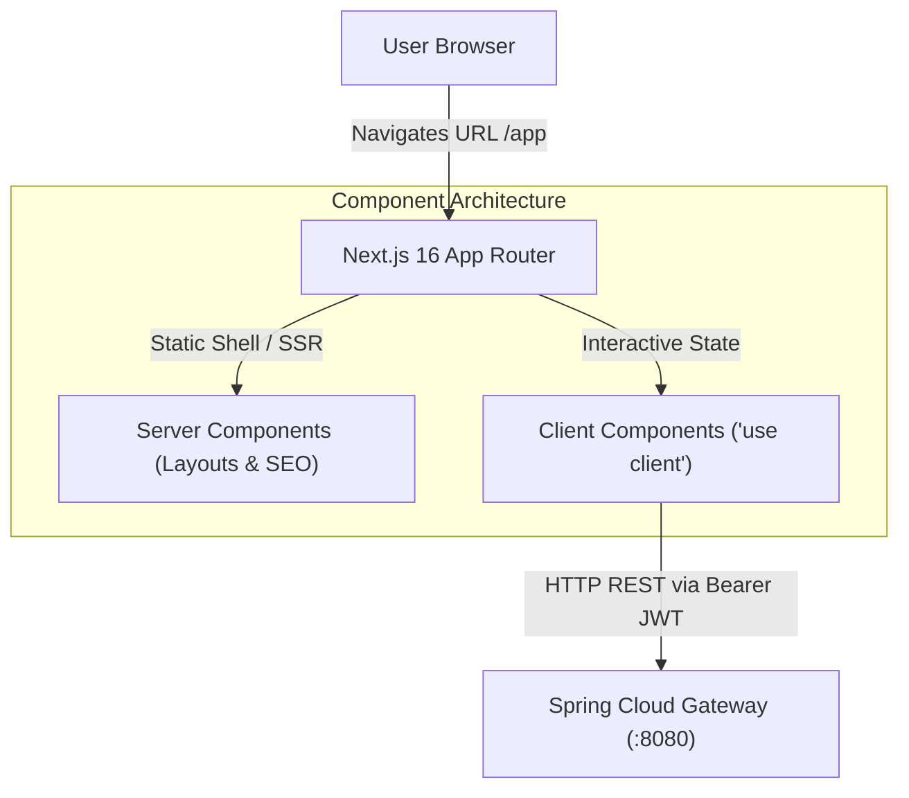
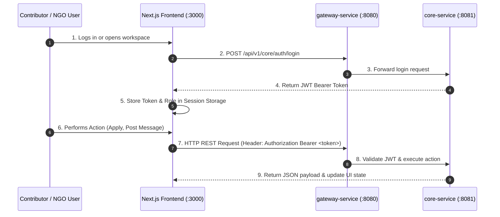

# 💻 Next.js 16 Civic Tech Frontend Application (`connecting-dots-frontend`)

The `connecting-dots-frontend` service is the user interface for **Connecting Dots V2**. Built on **Next.js 16 App Router** and **React 19**, it provides an intuitive, responsive civic technology platform connecting Non-Governmental Organizations (NGOs) with technical volunteer contributors.

---

## ⚡ 1. What is Next.js App Router Architecture?

**Next.js App Router** is a modern React framework designed around Server Components, client-side interactivity, file-based routing, and optimized layout trees.



### Key Architectural Concepts

* **⚡ Server & Client Components**: Heavy page layouts render on the server for instant First Contentful Paint (FCP) and SEO optimization, while interactive forms, modals, and chat windows run as client components (`'use client'`).
* **🔑 Centralized API Client**: Communicates exclusively through `gateway-service` on port `8080`, attaching stateless JWT Bearer tokens to all mutation requests.
* **🎨 Responsive Civic Tech Design System**: Styled with Tailwind CSS v4 using modern civic tech colors (Deep Teal `#0F766E`, Warm Amber `#D97706`) and persistent dark/light theme switching (`next-themes`).

---

## ⚙️ 2. Implementation in Connecting Dots V2

The frontend application runs on port `3000` and connects to the Spring Boot microservices backend via `gateway-service` (`http://localhost:8080`).

### 🔄 Application Architecture & Communications



---

## 🚀 3. Core Features & Key Components

### 1. Centralized Bearer Token API Client (`lib/api-client.ts`)
* Targets Spring Cloud Gateway (`http://localhost:8080`).
* Automatically attaches `Authorization: Bearer <token>` to request headers.
* Decodes JWT role claims (`ROLE_ADMIN`, `ROLE_NGO`, `ROLE_CONTRIBUTOR`) for client-side authorization gating.

### 2. Direct Signed Cloudinary Uploads (`lib/upload.ts`)
* Requests pre-signed upload parameters from `GET /api/v1/core/files/signature`.
* Uploads documents directly from the browser to Cloudinary.
* Automatically triggers backend AI ingestion (`POST /api/v1/core/problem-statements/{id}/ingest`).

### 3. Backend Cold-Start Banner (`components/backend-status-banner.tsx`)
* Detects free-tier cloud backend cold starts (e.g. Render 30–60s boot time).
* Displays a non-intrusive status notification during initial connection setup.

### 4. Application-Isolated 1-on-1 Messaging
* Binds messaging threads to `applicationId` (`/applications/[applicationId]`).
* Implements automatic 5-second polling for real-time conversation updates.

---

## 📁 4. App Routes & Directory Structure

```
app/
├── (public)
│   ├── page.tsx                       # Hero Landing & Open Problem Explorer
│   ├── profile/                       # Contributor & NGO Public Profiles
│   ├── review/                        # Post-project Rating Submission
│   └── reset-password/                # Password Recovery
├── ngo/
│   └── page.tsx                       # NGO Workspace & Problem Submission
├── contributor/
│   └── page.tsx                       # Contributor Workspace & Application List
├── applications/
│   └── [applicationId]/
│       └── page.tsx                   # 1-on-1 Application Message Thread
└── admin/
    └── page.tsx                       # Admin Operations Center

components/
├── backend-status-banner.tsx          # Cold-start backend detector
├── ngo-workspace.tsx                  # NGO problem submission & AI review queue
├── contributor-workspace.tsx          # Contributor application management
├── public-explorer.tsx                # Public problem & directory search
└── reviews-list.tsx                   # Community star rating reviews list
```

---

## 📊 5. Technical Specifications

| Parameter | Specification |
| :--- | :--- |
| **Port** | `3000` |
| **Framework** | Next.js 16.3.3 (App Router) |
| **UI Library** | React 19.0 |
| **Language** | TypeScript 5.7.3 |
| **Styling** | Tailwind CSS v4.3.3 |
| **Theme System** | `next-themes` (Light / Dark Mode) |
| **Gateway Target** | `http://localhost:8080` |
